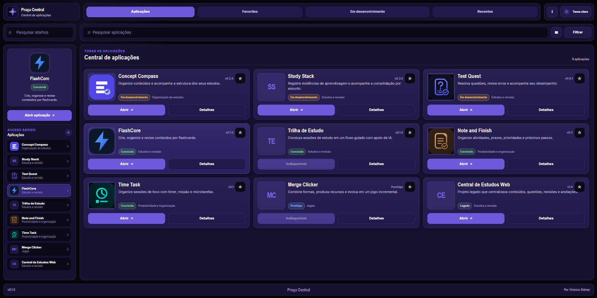

# Praça Central 🏛️

> Uma central web para organizar, explorar e acessar minhas aplicações em um único lugar.

[🌐 Abrir Praça Central](https://viniciusidney.github.io/praca-central/)



## Sobre o projeto

A **Praça Central** é uma aplicação criada para reunir meus projetos web em uma interface única, organizada e rápida de usar.

Em vez de depender apenas de uma lista de repositórios ou links espalhados, a aplicação funciona como um hub visual: cada projeto possui seu próprio card, informações de estado, categoria, versão e acesso direto quando existe uma publicação disponível.

O projeto também funciona como uma camada de apresentação do meu ecossistema de aplicações, preservando projetos concluídos, aplicações em desenvolvimento e projetos legados que fazem parte da evolução do meu trabalho.

## Funcionalidades

- catálogo centralizado de aplicações;
- pesquisa por nome, descrição, categoria, tags e tecnologias;
- filtros por categoria, status e favoritos;
- navegação entre aplicações, favoritos, projetos em desenvolvimento e acessos recentes;
- favoritos persistidos no navegador;
- registro de aplicações abertas recentemente;
- visualização em grade ou lista;
- painel lateral com aplicação selecionada e atalhos;
- modal com informações detalhadas de cada projeto;
- links diretos para aplicações publicadas;
- tema claro e escuro persistente;
- interface responsiva para desktop, tablet e celular;
- suporte a navegação por teclado e gerenciamento de foco;
- adaptação para safe areas e teclado virtual em dispositivos móveis.

## Catálogo atual

A Praça Central reúne atualmente aplicações de estudo, produtividade, organização e jogos, incluindo:

**Concept Compass · Study Stack · Test Quest · FlashCore · Trilha de Estudo · Note and Finish · Time Task · Merge Clicker · Central de Estudos Web**

Os dados do catálogo ficam centralizados em:

```text
src/scripts/data/applications.js
```

Projetos sem publicação disponível podem permanecer no catálogo com o acesso desabilitado até que uma URL pública seja definida.

## Tecnologias

- HTML5
- CSS3
- JavaScript
- ES Modules
- `localStorage`
- Git e GitHub
- GitHub Pages

O projeto não depende de framework ou backend para seu funcionamento atual.

## Arquitetura

A funcionalidade principal de aplicações é separada em responsabilidades:

```text
features/applications/
├── applications.model.js
├── applications.service.js
├── applications.ui.js
└── applications.controller.js
```

- **Model:** valida e normaliza os dados das aplicações.
- **Service:** concentra pesquisa, filtros, favoritos, recentes e persistência.
- **UI:** cria e atualiza cards, listas, detalhes e estados visuais.
- **Controller:** coordena estado, eventos, overlays, viewport e acessibilidade.

Essa divisão evita concentrar toda a lógica em um único arquivo e facilita a evolução independente de cada parte da interface.

## Responsividade e acessibilidade

A Praça Central foi construída para manter uma experiência consistente em diferentes tamanhos de tela.

Entre os comportamentos implementados estão:

- painel lateral fixo em telas maiores e drawer em telas menores;
- grade adaptativa de aplicações;
- filtros em formato de bottom sheet no mobile;
- alvos de toque com pelo menos 44 px;
- suporte a `viewport-fit=cover` e safe areas;
- adaptação ao `visualViewport` durante a abertura do teclado virtual;
- contenção e devolução de foco em drawers e modais;
- navegação por teclado;
- skip link para acesso direto à região principal de aplicações.

## Testes

O projeto possui documentação de testes manuais e uma auditoria específica de responsividade.

A auditoria responsiva automatizada já validou cenários em:

```text
360 × 640
390 × 844
412 × 915
768 × 1024
844 × 390
```

O catálogo atual também foi validado manualmente quanto a carregamento, pesquisa, filtros, abertura de aplicações, Recentes, Favoritos, persistência e detalhes dos cards.

Os registros estão disponíveis em:

- [`tests/manual-tests.md`](tests/manual-tests.md)
- [`tests/responsive-test-report.md`](tests/responsive-test-report.md)
- [`docs/06-testes.md`](docs/06-testes.md)

Testes finais em dispositivos físicos continuam relevantes para comportamentos específicos de teclado virtual, notch e navegadores móveis.

## Executar localmente

Como o projeto utiliza módulos JavaScript, recomenda-se executá-lo por um servidor local.

### Live Server

1. Abra o repositório no Visual Studio Code.
2. Clique com o botão direito em `index.html`.
3. Selecione **Open with Live Server**.

Também é possível utilizar outro servidor HTTP local.

## Estrutura principal

```text
praca-central/
├── docs/
│   └── assets/
├── public/
├── src/
│   ├── assets/
│   ├── scripts/
│   │   ├── core/
│   │   ├── data/
│   │   ├── features/
│   │   └── shared/
│   └── styles/
│       ├── base/
│       ├── components/
│       ├── layouts/
│       ├── pages/
│       ├── themes/
│       └── utilities/
├── tests/
├── .gitattributes
├── .gitignore
├── index.html
└── README.md
```

## Documentação

A pasta [`docs/`](docs/) preserva a documentação de planejamento e evolução do projeto:

- [`01-visao-do-projeto.md`](docs/01-visao-do-projeto.md)
- [`02-requisitos-e-escopo.md`](docs/02-requisitos-e-escopo.md)
- [`03-fluxos-e-telas.md`](docs/03-fluxos-e-telas.md)
- [`04-dados-e-arquitetura.md`](docs/04-dados-e-arquitetura.md)
- [`05-roadmap.md`](docs/05-roadmap.md)
- [`06-testes.md`](docs/06-testes.md)
- [`07-changelog.md`](docs/07-changelog.md)

## Estado do projeto

A Praça Central possui uma base funcional publicada e utilizável.

O foco atual está em consolidar o projeto como hub público do portfólio, manter o catálogo sincronizado com a evolução das aplicações e continuar refinando a experiência com base no uso real.

Possíveis evoluções futuras estão documentadas no [`roadmap`](docs/05-roadmap.md).

## Autor

Desenvolvido por **Vinícius Sidney**.
